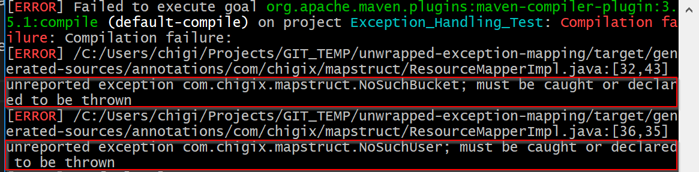
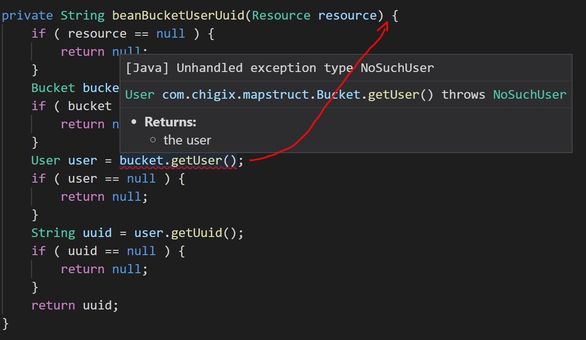

# About This Testing Case

Here is a problem appeared when exception is thrown in nested bean mapping, where the exceptions declared on getters in nested bean classes is not appended to the newly created private method by Mapstruct build plugin, although the codes on mapping are correctly generated. This problem just directly make java compilation could not pass, showing the fatal error of "Unreported Exception".

# Run

All code for this senerio have been prepared, directly run 

    mvn clean package

The errors would be shown:

And the problem in the generated code is highlighted below:

